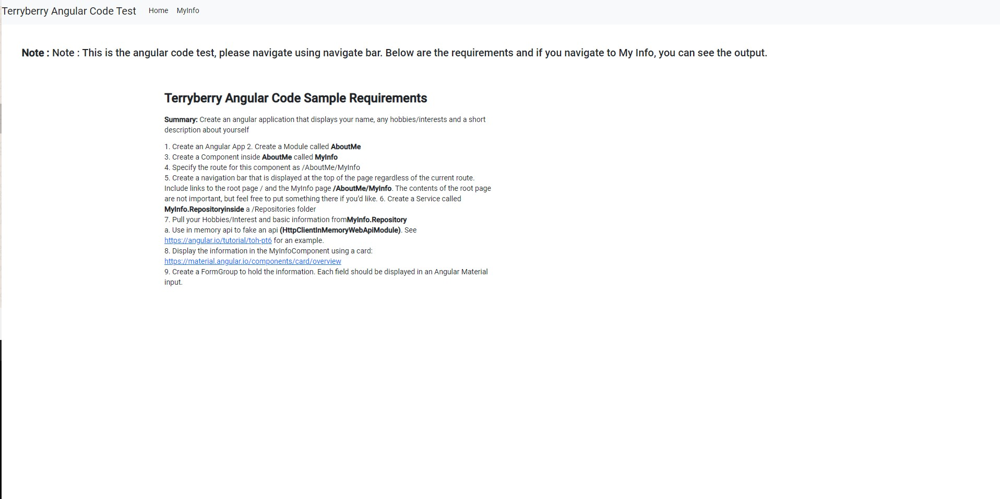
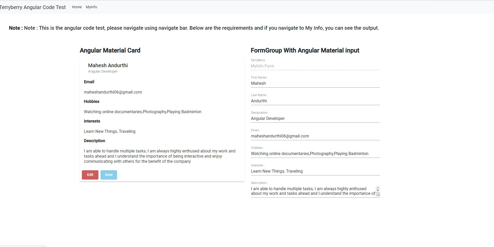

# Terryberry

## AboutMe Angular Application

This project was generated with [Angular CLI](https://github.com/angular/angular-cli) version 11.2.2.

## Table of Contents
- [About The Author](#about-the-author)
- [Project Setup](#project-setup)
  * [Prerequisites](#prerequisites)
  * [How To Install](#how-to-install)
  * [How To Run](#how-to-run)
  
- [Software Libraries Used](#software-libraries-used)
- [UI And Program Flow](#ui-and-program-flow)
  * [UI Begins With Home Page](#ui-begins-with-Home-Page)
  * [Two Main Views for Results](#two-main-views-for-results)


## About The Author

**Mahesh Andhurthi** is a Angular Developer with 4+ years of  experience

I am a good expert in **HTML**, **CSS**,**BOOTSTAP**,**Angular** and several other technologies java and others 


## Project Setup

### Prerequisites

You need to have Node and NPM installed on your PC.

[Downloading and installing Node.js and npm](https://docs.npmjs.com/downloading-and-installing-node-js-and-npm)

### How To Install

Download the source code using git or else download and unzip the zip file.

Open a terminal window and go to the project root folder.

You need to have npm installed globally.

Run `npm i` to install the required libraries.

### How To Run

Run `ng serve` for a dev server.

Navigate to `http://localhost:4200/`.

The browser will automatically reload if you change any of the source files.


## Running Example

### Screen Shot





## Software Libraries Used

The following major software libraries are used:
```text
Angular 11
Angular Material 11
Html 5
Bootstrap 5

```


## UI And Program Flow

This project demonstrates how to use Angular HttpClientInMemoryWebApiModule

An in-memory web api for Angular demos and tests that emulates CRUD operations over a RESTy API.

It intercepts Angular Http and HttpClient requests that would otherwise go to the remote server and redirects them to an in-memory data store that you control.


### UI Begins With Home Page 

The user enters the Home Page text and clicks the Home Tab.

in this Home page displayed Note As How we Follows  

### Two Main Views For Results

#### Home Page 

After clicking the Home Page , a list of Test Content titles is shown. .


##### MyInfo Page 

In this MyInfo Page Displayed Angular Mattrial card with web api data 

And we can see Formgrop Angular mattrial feilds 

